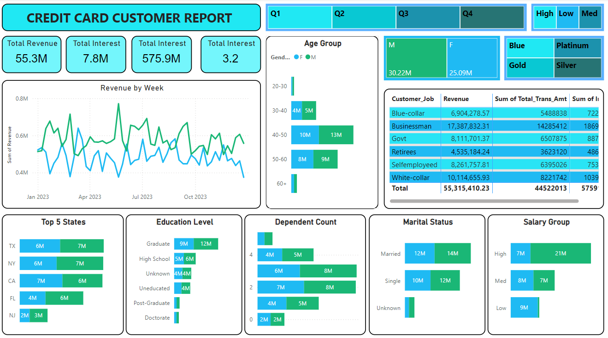

# 💳 Credit Card Insights Dashboard (Power BI Project)

This Power BI project presents a detailed analysis of credit card transaction and customer behavior for the year 2023. It uncovers actionable business insights using visual analytics to support decision-making in marketing, customer segmentation, and product strategies.

---

## 📸 Dashboard Preview

---

## 📌 Project Objectives

1. **Transaction Trends**  
   Analyze seasonal patterns to identify peak periods and transaction growth opportunities.

2. **Customer Segmentation**  
   Identify high-value customer profiles using demographics, education, and income levels.

3. **Actionable Business Insights**  
   Support strategic decisions with data-backed metrics, from regional performance to spending behaviors.

---

## 📊 Key Performance Metrics

| Metric | Value |
|--------|-------|
| 💰 Total Revenue | ₹55.3M |
| 💸 Total Interest Earned | ₹7.8M |
| 🔁 Total Transaction Amount | ₹44.5M |
| 🔢 Total Transactions | 655.7K |
| 👥 Total Income (Customers) | ₹575.9M |

---

## 🧠 Insights & Highlights

- **Top Card Tier**: Blue Card users are the highest contributors to revenue.
- **Top Quarter**: Q3 sees the highest transaction count (200K+).
- **Dominant Payment Method**: Swipe (₹35M), followed by Chip (₹17M).
- **High-Spending Demographics**:  
  - **Job**: Businessmen (₹17.3M)  
  - **Education**: Graduates (₹22M)  
  - **Age Group**: 40–50 (₹13M)  
  - **States**: California, Texas, New York

- **Balanced Gender Spending**:  
  - Males: ₹30.2M  
  - Females: ₹25M

---

## 🔧 Tools & Technologies

- 📊 **Power BI Desktop** – for dashboard creation
- 📑 **Microsoft Excel** – for data preprocessing
- 💻 **GitHub** – for version control and documentation

---

## 📂 Repository Contents

| File Name | Description |
|-----------|-------------|
| `credit_card_insights_dashboard.pbix` | Interactive Power BI dashboard file |
| `credit_card_insights_report.pdf` | Final report with metrics and visuals |
| `customer.PNG` | Dashboard preview image |
| `README.md` | Project documentation file |

---

## 🗺️ Recommendations

- 📍 Invest in high-revenue states (CA, TX) with regional offers.
- 💡 Promote underused methods like online/chip via cashback programs.
- 🎯 Focus on mid-aged professionals (30–50) and graduates for loyalty campaigns.
- 💳 Introduce premium perks for Gold/Platinum users to boost engagement.

---

## 👨‍💻 Author

**Ravi Kumar Raushan**  
📧 Email: [ravikumarraushan0703@gmail.com](mailto:ravikumarraushan0703@gmail.com)  
🔗 LinkedIn: [https://www.linkedin.com/in/ravi-kumar-raushan/](https://www.linkedin.com/in/ravi-kumar-raushan/)

---
